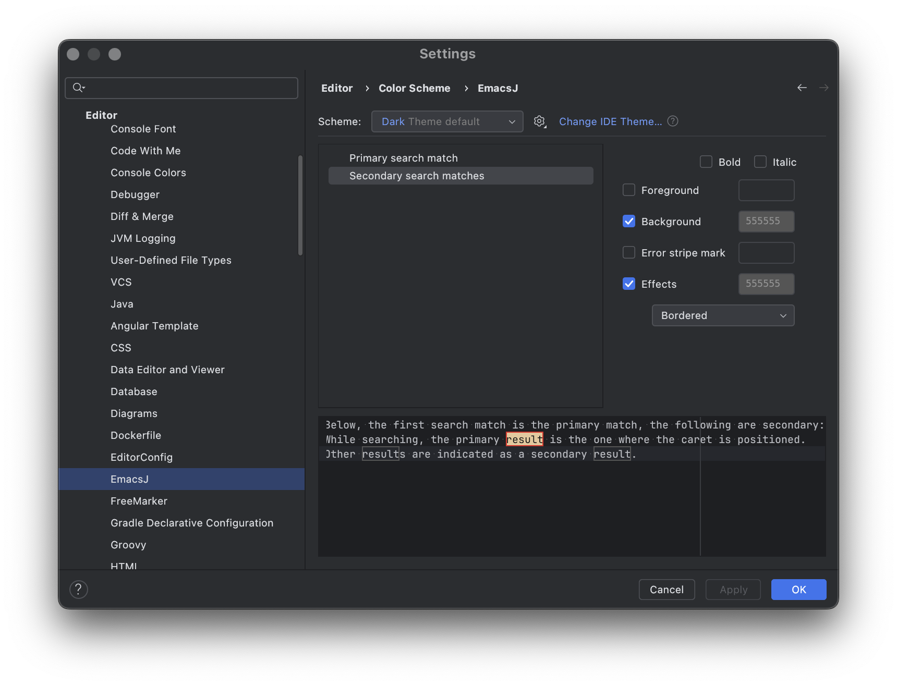

# EmacsJ

<!-- Plugin description -->
A collection of useful Emacs commands for text editing and search.

Documentation: EmacsJ on [GitHub](https://github.com/strindberg/emacsj)

This plugin offers a collection of commands for those of us who love Emacs and miss its functionality when working in IntelliJ-based IDEs.
It is mainly intended as an extension to IntelliJ's Emacs keymap, which lacks some functionality that an Emacs user will miss. EmacsJ's aim
is to offer features that make it easy to work in both Emacs and IntelliJ without having to retrain your muscle memory.

The easiest way to use the plugin after installation is to choose the *EmacsJ* or *EmacsJ (macOS)* keymap under <kbd>Settings</kbd> →
<kbd>Keymap</kbd>. This activates all the functionality of the plugin. You find all the bindings of the plugin under <kbd>
Settings</kbd> → <kbd>Keymap</kbd> → <kbd>Plugins</kbd> → <kbd>EmacsJ</kbd>, with short summaries of what the commands do. For more
extensive documentation, visit the plugin's GitHub page.

The keymap *EmacsJ (macOS)* uses the same bindings as the *EmacsJ* keymap, but with *command* instead of *option* in almost all bindings,
making it easier to use on a Mac keyboard.

The main features are:

- Incremental search modeled on Emacs' Isearch, with text and regexp search.
- Query-replace with text or regexps, with a very light-weight interface.
- Word commands: transpose, upper-case, lower-case, capitalize, move, delete.
- Easy access to clipboard history à la Emacs (kill ring).
- A mark history with the ability to pop mark (mark ring), and exchange point and mark.
- Universal argument: repeat commands a specified number of times.
- Append-next-kill: append copied/cut text to previous kill.
- Rectangle commands: copy, open, clear, paste.
- Zap to character.
- Go back and forward in XRef history.
- Whitespace commands: delete space around point, delete empty lines.
- Duplicate and comment regions and lines.
- Recenter and relocate caret.

Documentation: EmacsJ on [GitHub](https://github.com/strindberg/emacsj)
<!-- Plugin description end -->

## Installation

- Using the IDE built-in plugin system:

  <kbd>Settings/Preferences</kbd> > <kbd>Plugins</kbd> > <kbd>Marketplace</kbd> > <kbd>Search for "emacsj"</kbd> >
  <kbd>Install</kbd>

- Manually:

  Download the [latest release](https://github.com/strindberg/emacsj/releases/latest) and install it manually using
  <kbd>Settings/Preferences</kbd> > <kbd>Plugins</kbd> > <kbd>⚙️</kbd> > <kbd>Install plugin from disk...</kbd>

## Getting Started

1. Install the plugin from the JetBrains Marketplace or through GitHub.
2. Either:
    1. choose the keymap *EmacsJ* or *EmacsJ (macOS)* in Preferences → Keymap. This activates all the plugin commands and can then be
       deactivated or changed as needed.
    2. Alternatively, open Preferences → Keymap and choose the commands you wish to use under Plugins → EmacsJ. The plugin suggests key
       bindings, but they can, of course, be changed.
3. If a command doesn't seem to do anything, double-check that no other command is using the same key binding.

## Features

The EmacsJ plugin enables the following commands.

### Isearch

Incremental search. Each letter typed is added to the search, and the nearest match is highlighted, as well as all other visible matches.
The place of the current match among all matches is displayed together with the total number of matches. Keep adding letters to narrow
the search.

While searching, pressing the search key again jumps to the next match, if available. Once the matches are exhausted at the end of
the file, the search bar indicates that no more matches can be found. Pressing the search key again at this stage restarts the search at
the beginning of the file (or the end if reverse search is active). The direction of the search can be changed at any time with the
corresponding key.

The way Isearch interprets white space in the search string can be configured (see
[below](#isearch-configuration--lax-mode-and-selection-search)) between literal and lax interpretation and also changed during search. 
Whether an active selection should be used as the search argument when starting a search can also be configured.

There are four ways to start a search:

- Isearch Forward Text (`ctrl-s`). The search text is interpreted as literal text, and the search direction is forward in the editor.
- Isearch Backward Text (`ctrl-r`). The search text is interpreted as literal text, and the search direction is backward in the editor.
- Isearch Forward Regexp (`ctrl-shift-s`). The search text is interpreted as a regular expression, and the search direction is forward in
  the editor.
- Isearch Backward Regexp (`ctrl-shift-r`). The search text is interpreted as a regular expression, and the search direction is backward in
  the editor.

Directly after a search has been initiated, pressing one of the search keys again will bring up the previous text used for search. This is
the quickest way to resume a search. History is kept separate between text search and regexp search, so only previous searches by the same
type are offered. The search history does not distinguish between forward and backward searches.

Except for the keys below, any command key will abort search and execute the command. This makes Isearch handy as a navigation tool
as well: search for the word where you want to end up and keep on navigating with no extra key press required.

While searching, the following commands are available:

- `ESCAPE` or `ctrl-g`: abort the search and return the caret to the point where the search started.
- `ENTER`: finish search and leave the caret where it currently is.
- `ctrl-ENTER`: finish search and leave the caret at the start of the final match (or end of match if reverse search).
- `alt-ENTER`: finish search and mark the final match as selected.
- `BACKSPACE`: if several matches with the current search string have been visited, go back in the history of matches. If not, remove
  the last character from the search string.
- `ctrl-c SPACE`: toggle between lax and strict handling of whitespace in search string (only text search). The mode stays unchanged between
  searches so that a new search starts with the mode from the last search. The default mode can
  be [changed](#isearch-configuration--lax-mode-and-selection-search) under Settings.
- `alt-e`: enable editing of the search string. Searching (with the new search string) is resumed when pressing `ENTER`.
- `ctrl-w`: add the word at point in the editor to the search string.
- `ctrl-alt-e`: add the rest of the current editor line to the search string.
- `ctrl-alt-y`: add the character at point to the search string.
- `ctrl-shift-ENTER`: add a new line character to the search string.
- `alt-c`: toggle between case-sensitive and case-insensitive search.
- `alt-<`: move the caret to the first match of the current search without exiting Isearch.
- `alt->`: move the caret to the last match of the current search without exiting Isearch.
- `alt-p`: browse backward in the list of previous searches (with the current type).
- `alt-n`: browse forward in the list of previous searches (with the current type).
- `ctrl-l`: recenter. Scroll to put the current match at the center of the screen without interrupting the search. Repeated use behaves
  as [Recenter Caret](#recenterreposition).

Text from the clipboard can be pasted while searching: the contents of the clipboard will be added to the current search string.

Note that the keybindings above are only active while using Isearch, i.e. they do not clash with other commands having the same key
binding outside Isearch. The keybindings `ENTER`, `ESCAPE` or `ctrl-g`, `ctrl-l` and `BACKSPACE` are non-configurable.

Isearch text uses smart case: the search will be performed without case sensitivity if the whole search string consists of lower
case characters but switch to case-sensitive search if the search string contains one or more capital letters. This can be changed
by toggling between case-sensitive and case-insensitive search with `alt-c` (see above). Regexp search is always case-sensitive.

*Isearch* works with multiple carets.

#### Isearch configuration – lax mode and selection search

When lax mode is enabled in Settings, Isearch will replace every space in the search string with the supplied regular expression. This
makes it possible to search for string parts that are not adjacent. The default regular expression is '.*?' which means that a space will be
replaced with the shortest possible text that makes the whole search string match. The lax mode can be toggled during search as described
above. Lax search only works with text search, not regexp search.

The default mode (lax or strict) can be changed, as well as the regular expression used to replace space in Isearch, under Settings →
Editor → EmacsJ.

When selection search is enabled in Settings, Isearch will use the selected text as search argument if a selection is active when Isearch
is started. The drawback to this is that if enabled, Isearch cannot be used to expand an existing selection. Choose which alternative you
find the most convenient.

#### Isearch configuration - colors

To change the colors used by Isearch to mark matches, go to Settings → Editor → Color Schemes → EmacsJ. The colors chosen for primary
and secondary matches are used by both Isearch and Search/replace (below).

### Search/replace (query-replace)

Search/replace (query-replace) asks for a text or regexp to search for, and the replacement to be used. When replacement starts, each
match found triggers a request for confirmation.

There are two variants:

- Search and Replace Text(`alt-s`). Both arguments are interpreted as literal text.
- Search and Replace Regexp(`shift-alt-s`). Both arguments are interpreted as regular expressions.

Once the replacement text has been given, search is performed from the location of the caret, and at each match one can choose whether
to perform the change or not. The search stops at the end of the file.

When Search/replace is invoked, the last Search/replace command (if any) is suggested in the search bar. Pressing ENTER accepts the
suggestion and initiates the search.

If a selection is active when Search/replace is started (i.e. a region is selected), the replacement is only performed within the selected
region.

When using regexp search, back references to captured groups (parts of the search string delimited by parenthesis) in the matched string can
be used in the replace-string either in java style (`%1, %2, ...`) or with backslash (`\1, \2, ...`). The whole match can be referenced
by `$0` or `\&`. To replace with a literal string which could be interpreted as a back reference, use double backslash, such as `\\1`
or `\\&`.

When specifying the search text or the replace-text, the following keys are active:

- `ctrl-shift-ENTER`: add new line character to the search text or replace text.
- `alt-p`: browse backward in the list of previous Search/replace (of the current type).
- `alt-n`: browse forward in the list of previous Search/replace (of the current type).

While replacing, the following keys are active:

- `.`: perform the replacement on this match and then stop.
- `y` or `SPACE`: perform the replacement and move to the next match.
- `,`: perform the replacement but do not move to the next match. The next (valid) key press moves to the next match.
- `n`: do not perform the replacement and move to the next match.
- `!`: perform the replacement on this and all the following matches.
- `e`: edit the replacement text. `ENTER` finishes editing and search/replace is resumed with the new replacement text.
- `u`: undo the last replacement without exiting search/replace. Can be repeated to undo previous replacements.
- `^`: visit the position of the last replacement without exiting search/replace. Can be repeated to visit previous replacements.
- `ctrl-l`: recenter. Scroll to put the current match at the center of the screen without interrupting the search. Repeated use behaves
  as [Recenter Caret](#recenterreposition).

Note that the keybindings above are only active while using Search/replace, i.e. they do not clash with other commands having the same key
binding outside Search/replace. The keybindings `y`, `SPACE`, `,`, `n`, `!`, `e`, `u`, `^`, `.` and `ctrl-l` are non-configurable.

Search/replace text uses smart case such that the search will be performed without case sensitivity if the whole search string and the
whole replacement string consist of lower case characters, but switch to case-sensitive search if the search string or replace string
contains one or more capital letters. If you need to search and replace two lower case strings and not match upper case letters, use regexp
search/ replace, which is always case-sensitive.

Colors used by Search/replace can be configured as described under Isearch [above](#isearch-configuration---colors).

### Universal Argument

*Universal Argument* can be used to repeat any subsequent command. The argument can be specified as described below, and the following
command will be executed the specified number of times.

Note that *Universal argument* cannot be used to repeat recorded macros because of a limitation in the IntelliJ platform.

*Universal Argument* can be invoked in one of three ways:

- Pressing the *Universal Argument* key one or more times. The first keypress sets the argument to 4, and each successive keypress
  multiplies the argument by four: 4, 16, 64, 256, ...
- Pressing the *Universal Argument* key and then specify the argument by digits. Specifying digits takes precedence over the default
  multiples of four.
- Starting *Universal Argument \[0,1,...,9]* with one of the dedicated numeric commands. The number can then be further specified by typing
  more digits.

A few commands &mdash; [Paste: Leave Caret at Point](#paste-kill-ring) and [Pop Mark](#mark-ring) &mdash; are invoked by using *Universal
Argument* before invoking their standard counterparts (*Paste: Leave Caret After Pasted Region* and *Push Mark*, respectively).

A repeating command can be interrupted by pressing `ctrl-g`.

The commands are:

- Universal Argument (`ctrl-u`). Start accepting an argument with default value 4. Repeated invocations multiply the argument by four.
  Typing digits after activation specifies the argument.
- Universal Argument\[0,1,...,9] (`ctrl-alt-[0,1,...,9]`). Use the key value as the first digit in the specified argument. Further digits
  can be typed before the command to be repeated.
- Cancel Repeating Action (`ctrl-g`). Stop the current action from repeating.

### Word Movement

EmacsJ's word movement commands are similar to the default IntelliJ word movements but with a slight difference in how word boundaries
and non-word characters are handled. In standard IntelliJ, *Kill to Word End* will delete characters up to the next non-word character,
whereas the corresponding command *Delete Next Word* in EmacsJ will delete past non-word characters and to the end of the following
proper word. The same goes for word movements such as *Next Word* and *Previous Word*.

These commands honor the IDE's setting "Use camel case".

The commands *Delete Next Word* and *Delete Previous Word* respect the *Append Next Kill* command.

The commands are:

- Move Caret to Next Word (`alt-f`). Move the caret to the end of the current word (where the current word is defined as everything up
  to the next end of word characters).
- Move Caret to Previous Word (`alt-b`). Move the caret to the start of the current word (where the current word is defined as everything
  back to the next end of word characters, read backwards).
- Delete Next Word (`alt-d`). Delete characters to the end of the current word (defined as above).
- Delete Previous Word (`alt-BACKSPACE`). Delete characters back to the start of the current word (defined as above).

The *Word Movement* commands work with multiple carets.

### Modify Word

The modify-word commands use word boundaries in the same way as the word movement commands defined [above](#word-movement).
They will modify the characters in the current or previous word or -- if selection is active -- modify the current selection.

The commands modifying the following word also move the caret to the end of this word. The commands modifying the previous word do not move
the caret.

The Capitalize Word commands will skip over non-word characters until it finds a word to capitalize. If Capitalize Word is used with an
active selection, each word in the region is capitalized.

The commands are:

- Upper Case Word at Point or Region (`alt-u`).
- Upper Case Previous Word (`shift-alt-u`).
- Lower Case Word at Point or Region (`alt-l`).
- Lower Case Previous Word (`shift-alt-l`).
- Capitalize Word at Point or Region (`alt-c`).
- Capitalize Previous Word (`shift-alt-c`).

The *Modify Word* commands work with multiple carets.

### Transpose Words

The transpose-words commands interchange the word at point with either the following or previous word. Non-word characters are skipped over,
so that if two transposed words are separated by non-word characters, the words change place with the same delimiters between them as before
the change.

The exact boundary between the words depends on the direction of the command: when using *Transpose Current and Next Word*, the current
word's boundaries are defined as from the first character of the word, up to the start of the next word. When using *Transpose Previous and
Current Word*, the current word is instead defined as from the end of the previous word up to the current word's last character. The upshot
of this is that both commands can be used repeatedly to move the current word forwards or backwards several places.

If the selection is active, the selected region is transposed with the following or previous word, respectively.

The commands are:

- Transpose Current and Next Word (`alt-t`). Change the order of the word at point (or region) and the following word.
- Transpose Previous and Current Word (`shift-alt-t`). Change the order of the word at point (or region) and the previous word.

The *Transpose Word* commands work with multiple carets.

### Delete Whitespace on the Current Line

The delete whitespace commands reduce the number of whitespace characters around point.

The commands are:

- Delete All Whitespace Around Point (`ctrl-BACKSPACE`). Delete whitespace before and after caret. If used after *Universal Argument*, only
  delete whitespace to the left of the cursor.
- Leave One Space at Point (`alt-SPACE`). Reduce all whitespace around point to only one space.

The *Delete Whitespace* commands work with multiple carets.

### Delete Blank Lines

The command *Delete Blank Lines* deletes lines that are either empty or only containing whitespace. If the caret is currently
on a non-blank line, all subsequent blank lines are deleted. If the current line is blank and the surrounding lines are non-blank, the
current line is deleted. If the current line is blank and forms part of a consecutive number of blank lines, the blank lines are reduced to
a single blank line.

The commands are:

- Delete Blank Lines(`ctrl-x ctrl-o`).

The *Delete Blank Lines* command works with multiple carets.

### Duplicate and Comment

*Duplicate Line/Region* and *Duplicate Line/Region and Comment* duplicate the current line or the selected region. *Duplicate Line/Region
and Comment* also comments the original region or line.

The difference between IntelliJ's standard duplicate command and the EmacsJ command *Duplicate Region* is that the latter leaves the caret
at its original position and doesn't move it to the end of the new copy.

The command *Copy From Above Command* duplicates the first non-blank line above the current line, from the column of the caret. Without an
argument in copies the rest of the line from the starting column. After *Universal argument*, it copies the number of characters specified.
The command does nothing if a selected region is active.

*Comment DWIM (Do What I Mean)* will comment the current line if no selection is active. If the selection is active, it will comment the
selected region, using line comments if the region's start is at a line start and the end is at either a line's start or end. Otherwise,
block comment will be used. If the line or region is already commented, the command instead uncomments the line or region.

The commands are:

- Duplicate Line/Region (`ctrl-c y`).
- Duplicate Line/Region and Comment (`ctrl-c c`).
- Copy From Above Command (`ctrl-c a`).
- Comment DWIM (Do What I Mean) (`alt-SEMICOLON`).

The *Duplicate and Comment* commands work with multiple carets.

### Rectangles

A rectangle is defined as the rectangular region limited by the caret's point and its opposite corner in the active selection. To use these
commands, first select a region and then use the proper command. No characters outside the rectangle will be affected.

Note that unlike Emacs, IntelliJ cannot display the selected rectangle as a rectangle, but the commands work as described.

The *Rectangle: Paste* command does not require an active selection but will paste multiple lines starting at the same column as the
current caret on each line.

The commands are:

- Rectangle: Copy (`ctrl-x alt-c`). Copy the contents of the rectangle to the clipboard.
- Rectangle: Cut (`ctrl-x alt-k`). Copy the contents of the rectangle to the clipboard and delete it from the editor. Text to the right of
  the rectangle is adjusted leftward.
- Rectangle: Open (`ctrl-x alt-o`). Create a blank rectangle by shifting all text to the right of the rectangle.
- Rectangle: Clear (`ctrl-x alt-c`). Create a blank rectangle by replacing all text within the rectangle with space.
- Rectangle: Paste (`ctrl-x alt-p`). Paste the contents of the clipboard, starting at the same column on each line. Text to the right of the
  insertion point is shifted rightward.

### Paste (kill ring)

The paste commands enable the use of a paste history (kill ring) where a pasted snippet can be replaced by previously copied texts. By
repeatedly pressing *Paste: Previous Item in Clipboard History* after use of *Paste: Leave Caret After Pasted Region* or *Paste: Leave Caret
at Point*, the pasted text is replaced by the next item in the list of previously killed texts.

*Paste: Leave Caret at Point* is triggered when using *Paste: Leave Caret After Pasted Region* after [Universal
Argument](#universal-argument). It can also be invoked explicitly with a dedicated key binding, but by default it is not bound to any key.

The paste commands respect numeric *Universal argument*, and will paste the kill ring element chosen with the argument, counted from
the end. In other words, pressing `ctrl-alt-2`and then `ctrl-y` will paste the penultimate item in the kill ring. Paste after non-numeric
*Universal argument* (i.e. `ctrl-u`) invokes *Paste: Leave Caret at Point* as described above.

All paste commands push the opposite end of the pasted region as a mark to the [mark ring](#mark-ring) (without starting a selection). In
other words, when using *Paste: Leave Caret After Pasted Region*, a mark is pushed at the beginning of the pasted region, and vice versa
for *Paste: Leave Caret at Point*.

The items offered when using *Paste: Previous Item in Clipboard History* are filtered for duplicates and blank entries.

The commands are:

- Paste: Leave Caret After Pasted Region (`ctrl-y`). This command works as standard IntelliJ *Paste*, but it sets up the paste history so
  that further invocations of *Paste: Previous Item in Clipboard History* can suggest previously killed/copied texts.
- Paste: Leave Caret at Point. Works as *Paste: Leave Caret After Pasted Region* but leaves the caret at the current point and not at
  the end of the pasted text. Triggered when used after *Universal Argument*.
- Paste: Previous Item in Clipboard History (`alt-y`). Cycle through the history of killed text, replacing the previously pasted text.

The *Paste* commands work with multiple carets.

### Mark Ring

EmacsJ maintains a mark history (mark ring) if the plugin's *Set/Push Mark for Selection* command is used. This makes it possible to
pop previous marks and go back to these previous locations. A separate mark history is maintained for each file where it is used. The
history only contains unique positions: a new mark replaces any earlier item at the same position in the file.

Besides maintaining a mark history, another difference between EmacsJ's command and the standard IntelliJ set-mark command is that the
former always starts a new selection, whereas IntelliJ's command toggles selection. In other words, if a selection is already active, using
the EmacsJ command starts a new selection at the current point, instead of only turning off the selection.

Adding to the mark history without starting a new selection can be achieved by hitting the *Set/Push Mark for Selection* command
twice in the same position.

*Pop Mark* is triggered when using *Push Mark* after [Universal Argument](#universal-argument). It can also be invoked explicitly with a
dedicated key binding, but by default it is not bound to any key.

The commands [Isearch](#isearch) and [Search/replace](#searchreplace-query-replace) set the mark at the beginning of a search so that one
can return to the position where the latest search started. The command [Exchange Point and Mark](#exchange-point-and-mark) also uses the
mark history, as described below.

The commands are:

- Set/Push Mark for Selection (`ctrl-SPACE`). Set the mark (and activate sticky selection). The mark is saved to the mark history. To only
  save the mark to history without starting selection, hit the key binding twice (`ctrl-SPACE ctrl-SPACE`).
- Pop Mark. Pop an item from the mark history and return the caret to the saved position. Triggered when used after *Universal Argument*.

### Exchange Point and Mark

When a selection is active, *Exchange Point and Mark* switches the position of the selection start and the current caret. The selected
region can then be expanded in another direction. The location of the caret before the exchange is added to the mark history.

If the selection is not active when the command is used, sticky selection is activated between the current point and the last saved mark.

The commands are:

- Exchange Point and Mark (`ctrl-x ctrl-x`). Switch positions of selection start and current point. Reactivate selection from the previous
  mark if no selection is active.

### Recenter/Reposition

*Recenter* and *Reposition* cycles the location of the caret between three different locations: middle, top and bottom of the currently
visible part of the editor. *Recenter* scrolls the editor contents to move the caret, whereas *Reposition* only moves the caret without
scrolling the editor.

The commands are:

- Recenter Caret (`ctrl-l`). Cycle the position of the caret between the middle, top and bottom by scrolling the editor contents.
- Reposition Caret (`alt-r`). Cycle the position of the caret between the middle, top and bottom without scrolling the editor contents.

### Zap to Character

After activating one of the *Zap to character* commands, type the character which should be the end of the deleted region. Everything
between the caret and the next occurrence of the given character is deleted. The deleted part is added to the kill ring. There are four
variants of this command: kill the text including or not including the given character, forward or backward respectively.

If the given character is not found, no text is removed.

If the previous command was *Universal argument*, the zap commands delete to (or up to) the Nth occurrence of the given
character, with N as the universal argument. If the number of found occurrences is too low, no text is removed.

All these commands respect the *Append Next Kill* command (see [below](#kill-commands-and-append-next-kill)).

The commands are:

- Zap To Character (`alt-z`). Kill everything up to and including the given character.
- Zap Up To Character (`shift-alt-z`). Kill everything up to but not including the given character.
- Zap Back To Character (`ctrl-alt-z`). Kill everything up to and including the given character backwards.
- Zap Back Up To Character (`ctrl-shift-alt-z`). Kill everything up to but not including the given character backwards.

The *Zap to Character* commands work with multiple carets.

### XRef History

When using any of the (IntelliJ standard) commands *Go to Declaration* or *Go to Declaration or Usages*, EmacsJ saves the caret position
from which the jump is made, creating a stack of previous positions. This stack can be popped with the command *XRef Go Back*, and one can
thus easily go back to previous positions.

After *XRef Go Back*, the command *XRef Go Forward* can be invoked to return to the point where *XRef Go Back* was invoked.
This is supported by a forward/redo stack that can be traversed in multiple levels.

The command *XRef Push Mark* pushes the current position onto the XRef (backward/undo) stack and clears the foward/redo stack. This command
does not have a default key binding.

The commands are:

- XRef Go Back (`alt-COMMA`). Pop one item from the stack of previous positions and return the caret to that position.
- XRef Go Forward (`ctrl-alt-COMMA`). Go forward to the point where a previous XRef Go Back was invoked.
- XRef Push Mark. Push the current position onto the XRef (backward) stack.

Note that unlike all other key bindings in the *EmacsJ (macOS)* keymap where the *command* key is used instead of *option*, the binding
for XRef Go Back does not use `command-COMMA` but `option-COMMA`. This is chosen to not override the standard macOS binding `command-COMMA`
for Preferences.

### Kill commands and Append Next Kill

Kill commands in Emacs (and EmacsJ) refer to cutting or copying text and adding the text to the clipboard. Killed text is added as a new
element in the kill ring, unless the killed text is adjacent to the previously killed text. These kill ring items can be cycled through with
the paste history command, documented [above](#paste-kill-ring).

*Kill Line* works like the standard IntelliJ command *Cut up to Line End*: it kills (and copies) the rest of the current line. If
there is only whitespace between caret and end of the line, the newline character is also killed. This EmacsJ command expands the standard
command such that the newline character is also killed if the caret is positioned on the very first position of the line.

*Kill Whole Line* kills (and copies) the whole current line, including the newline character. It places the caret at the start of the
following line.

*Kill Ring Copy* and *Kill Ring Cut* kill the current selection with copy or cut. If the selection is not active, the commands affect the
whole current line, including the newline character.

The command *Append Next Kill* will set up a waiting state so that if the next command is a cut or copy, the killed text is joined (appended
or prepended) with the previous kill ring item. All the commands documented in this section respect the *Append Next Kill* command.
Furthermore, the delete word commands &mdash; *Delete Previous Word* and *Delete Next Word* &mdash; (See [Word Movement](#word-movement)),
as well as the zap commands &mdash; *Zap To Character*, *Zap Up To Character*, *Zap Back To Character* and *Zap Back Up To Character*
&mdash; (See [Zap to Character](#zap-to-character)), also respect *Append Next Kill*.

If the kill is "backwards" after *Append Next Kill* or if the caret is in front of the killed region, the region is prepended to the
existing kill ring item. This means that *Kill Ring Copy* and *Kill Ring Cut* both prepend if the caret is before the selection. *Delete
Previous Word*, *Zap Back To Character* and *Zap Back Up To Character* also prepend after *Append Next Kill*.

The commands are:

- Kill Line (`ctrl-k`). Kill and copy the rest of the current line, including the final newline character if the caret is on the first
  position of the line or there is only whitespace between caret and line end.
- Kill Whole Line (`ctrl-alt-k`). Kill and copy the whole current line, including the final newline character.
- Kill Ring Copy (`alt-w`). Kill and copy the active selection. If no selection is active, the whole line including the newline
  character is used as selection.
- Kill Ring Cut (`ctrl-w`). Kill and cut the active selection. If no selection is active, the whole line including the newline character
  is used as selection.
- Append Next Kill (`ctrl-alt-w`). If the next action is a kill command (or delete previous/next word), the killed text will be appended or
  prepended to the current clipboard entity.

The *Kill* commands work with multiple carets.

### Transpose Lines

*Transpose Lines* interchanges the line at point with the preceding line. If a numeric argument is set by *Universal Argument*, the
command will interchange the current line with the Nth preceding line, with N being the universal argument. If the Universal argument
is 0, the current line is interchanged with the line where the mark is currently set.

The commands are:

- Transpose Lines (`ctrl-x ctrl-t`). Interchange the current line with the preceding line. Universal argument modifies the behavior as
  described above.

### Buffer Beginning/End Movement

*Beginning of Buffer* and *End of Buffer* work as the IntelliJ commands *Move Caret to Text Start* and *Move Caret to Text End*,
respectively. They also set a mark at the point where the command is invoked, unless a selection is active.

The commands are:

- Beginning of Buffer (`alt-LESS`). Move the caret to the beginning of the current editor text. Set the mark where the command is invoked.
- End of Buffer (`alt-GREATER`). Move the caret to the end of the current editor text. Set the mark where the command is invoked.
